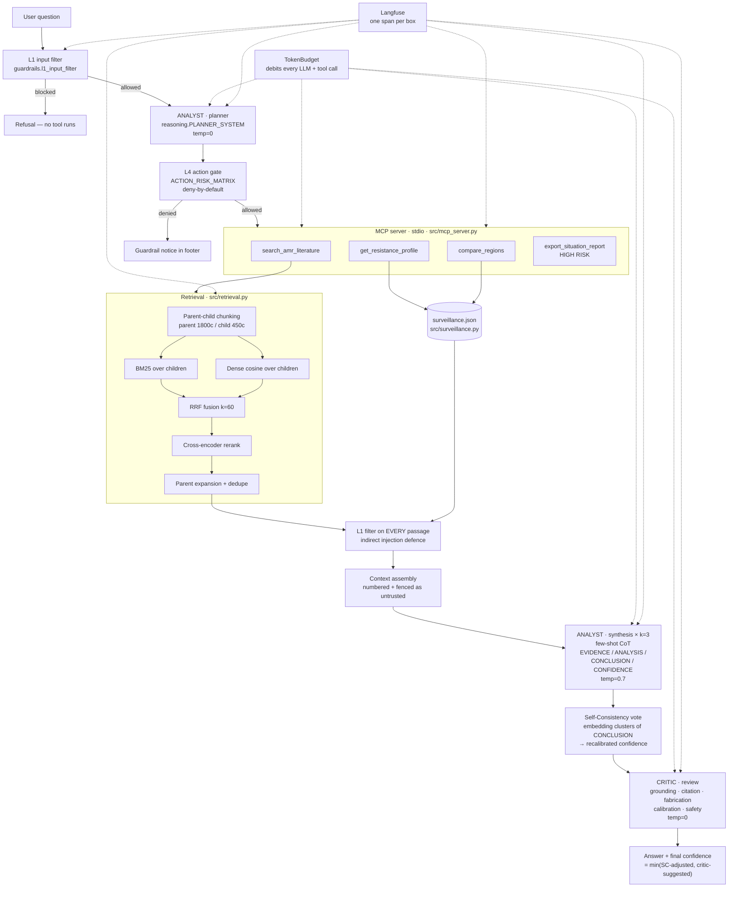

# Architecture

## System diagram

If Mermaid does not render in your viewer, the ASCII equivalent is in
[`README.md`](../README.md#architecture).

---

## Components

### `src/config.py`
Every tunable in the system, loaded once from `.env` into a frozen dataclass.
Modules import `settings`; nothing else calls `os.getenv`. Holds the cost model —
real OpenAI rates per model, so the cost-per-run metric is billed dollars.

### `src/llm.py`
The only module that talks to OpenAI. One `chat()` function wraps
`chat.completions.create`. Every call opens a Langfuse generation span, records
usage (`prompt_tokens`/`completion_tokens`) and debits the run's `TokenBudget`.
`health_check()` fails at startup with an actionable message — missing key, wrong
model, no billing — rather than a stack trace mid-run. `extract_json()` parses
defensively.

### `src/embeddings.py`
Dense embeddings via the OpenAI embeddings API (`text-embedding-3-small`). One
module so retrieval and the Self-Consistency vote embed through the same code
path and cannot silently compare vectors from different spaces. The cross-encoder
reranker is deliberately *not* here — it is local, because OpenAI has no
reranking endpoint and a reranker scores query-passage pairs jointly rather than
producing a vector.

### `src/retrieval.py`
The retrieval pipeline, in five stages.

**Parent-child chunking.** Documents are split into ~1800-character parents and
each parent into ~450-character children with 80 characters of overlap. Children
are what gets embedded and searched; parents are what the model reads. A
450-character window routinely cuts a sentence in half and drops the qualifier
that makes a number meaningful ("…36.1% in 2022" without "of invasive
isolates"). Matching on children keeps the embedding specific; returning parents
keeps the claim interpretable.

**BM25 arm.** Lexical retrieval over tokenised children. The tokeniser
deliberately keeps digits and hyphens joined — `mrsa`, `esbl`, `2023`,
`third-generation` — because AMR queries are dense in codes and years, and those
are exactly the tokens where lexical matching beats embeddings.

**Dense arm.** Cosine similarity over normalised embeddings from the shared
`embeddings.embed()` (OpenAI `text-embedding-3-small`).

**RRF fusion.** `score(d) = Σ 1/(k + rank(d))`, k=60. Rank-based rather than
score-based, which is the point: BM25 scores are unbounded and corpus-dependent
while cosine sits in [-1, 1], so the two cannot be summed directly. Ranks are
comparable by construction and need no per-corpus calibration.

**Cross-encoder reranking.** The top ~40 fused candidates are scored by
`ms-marco-MiniLM-L-6-v2`, which reads query and passage jointly rather than
comparing two independently-computed vectors. This is the expensive stage — one
forward pass per pair — hence the bounded candidate window.

**Parent expansion and dedupe.** Winning children are replaced by their parents,
deduplicated by parent id so two children of the same parent do not put it in
the context twice.

`HybridRetriever(mode="baseline")` disables the hierarchy, the BM25 arm and the
reranker, leaving flat top-k cosine. It exists so the baseline column of the
RAGAS table is produced by code rather than by recollection.

### `src/surveillance.py`
In-memory store over `data/surveillance.json`. Not a database, deliberately — a
few hundred rows loaded into a list is the honest choice at this size, and
REPORT.md §6 names the row count at which it stops being. Holds the organism
alias table (`MRSA` → `Staphylococcus aureus`) because that is a data concern,
not a tool concern. `compare()` aligns regions on their common years before
differencing, so a reported gap is never an artefact of comparing 2022 against
2019.

### `src/mcp_server.py`
FastMCP server on stdio, four tools. Every tool returns a JSON string and never
raises: MCP transports an exception as a protocol error, which the model cannot
reason about, whereas `{"error": ..., "hint": ...}` is something it can recover
from. Docstrings follow a fixed shape — *Use when* / *Do NOT use when* / *Args*
/ *Returns* / *Example* — because those docstrings are the tool descriptions the
model actually sees, and the *Do NOT use when* clause is what stops the planner
reaching for search when it wants a number.

Logging goes to stderr. Stdout is the MCP transport; a stray `print` corrupts
the protocol.

### `src/guardrails.py`

**L1 input filter.** Normalise, then match. Normalisation is NFKC, plus explicit
homoglyph folding (Cyrillic look-alikes are distinct characters, not
compatibility variants, so NFKC leaves them alone), plus stripping of zero-width
and bidi controls, plus collapsing of letter-spacing padding. Eight patterns at
two severities: `BLOCK` refuses the whole input, `SANITISE` redacts the span.

Applied to the user's question **and to every retrieved passage, with identical
rules**. Trusting the corpus more than the user is precisely the mistake that
indirect injection exploits.

**L4 action gate.** `ACTION_RISK_MATRIX` maps every tool to a risk tier and an
approval requirement. Unlisted tools are denied — deny-by-default, so adding a
tool without a policy fails closed. Tool *arguments* are re-run through L1,
because the model chose them and may have chosen them under the influence of a
retrieved document. The default approver denies: unattended runs must not be
able to trigger side effects because nobody was present to say no.

**TokenBudget.** Debits every LLM and tool call. `check()` is advisory and
`spend()` raises; the agent's loop uses `check()`, so exhaustion produces a
partial answer with the fact recorded in the footer rather than a crash.

### `src/reasoning.py`
Prompts and the Self-Consistency vote.

The synthesis prompt carries two exemplars. The first shows the well-supported
case. The second shows the case an 8B model gets wrong most often — thin context,
where the desired behaviour is to state the gap and drop to LOW confidence
rather than to answer fluently from parametric memory.

`self_consistency_vote` clusters the k CONCLUSIONs by embedding cosine at 0.80
rather than comparing strings, because three correct free-text answers are three
different strings. Within the winning cluster it takes the sample with the most
citations, tie-broken by stated confidence. It then **recalibrates**: full
agreement leaves confidence alone, partial agreement caps it at MEDIUM, majority
below 50% forces LOW. A sample claiming HIGH while the other two disagree with it
is overconfident by construction, and catching that is the main thing
Self-Consistency buys over a single greedy decode.

### `src/agent.py`
Orchestration, and the two agent roles.

The **analyst** plans, retrieves and synthesises. The **critic** audits: five
named checks (grounding, citation, fabrication, calibration, safety) returning a
JSON verdict of PASS / REVISE / FAIL with per-issue severity. The critic never
rewrites — it reviews, and its verdict is surfaced in the output.

Final confidence is `min(self-consistency-adjusted, critic-suggested)`. Two
independent estimates, and the lower is taken. An agent that talks itself up
when its own reviewer disagrees is the failure mode worth engineering against.

The MCP connection is a real stdio subprocess speaking the protocol, not a
direct import. That indirection costs process-startup latency per run and buys
the property that the tools are reachable by any MCP client — the Inspector,
Claude Desktop, another agent — rather than only by this loop.

### `src/observability.py`
Langfuse changed its Python API between v2 (`client.trace()`) and v3
(OpenTelemetry-style `start_as_current_span`). Rather than pin one and break on
the other, this module exposes one internal interface — `trace()` / `span()` /
`generation()` context managers — and adapts to whichever client is installed.
Missing or unconfigured Langfuse degrades to no-ops.

---

## Design decisions worth defending

**Deterministic guardrails, not an LLM classifier.** L1 is regex over normalised
text. An LLM-based injection classifier would generalise to novel phrasings that
regex misses. It would also be non-deterministic, add a full LLM call of latency
to every input and every retrieved passage, and — the decisive objection — be
itself susceptible to injection. A guardrail that can be talked out of its job is
not a guardrail. The cost is real and is stated in REPORT.md §6: novel
paraphrases that avoid every listed keyword pass L1, and the `wrap_untrusted`
fencing plus the L4 gate are what stand behind it.

**Rank-based fusion over score normalisation.** The alternative to RRF is
min-max or z-score normalising BM25 and cosine onto a common scale and taking a
weighted sum. That requires a per-corpus calibration step that silently goes
stale when the corpus changes. RRF needs no calibration.

**Self-Consistency on the synthesis step only.** Applying it to the planner too
would triple planning cost for a step whose output is a short JSON array that is
already validated against `ACTION_RISK_MATRIX`. The variance that matters is in
synthesis.

**The critic is advisory, not a gate.** It cannot block an answer, only annotate
it and lower its confidence. A blocking critic on an 8B model would reject good
answers often enough to make the agent unusable, and there is no second analyst
to escalate to. REPORT.md §6 describes what a blocking configuration would need.
